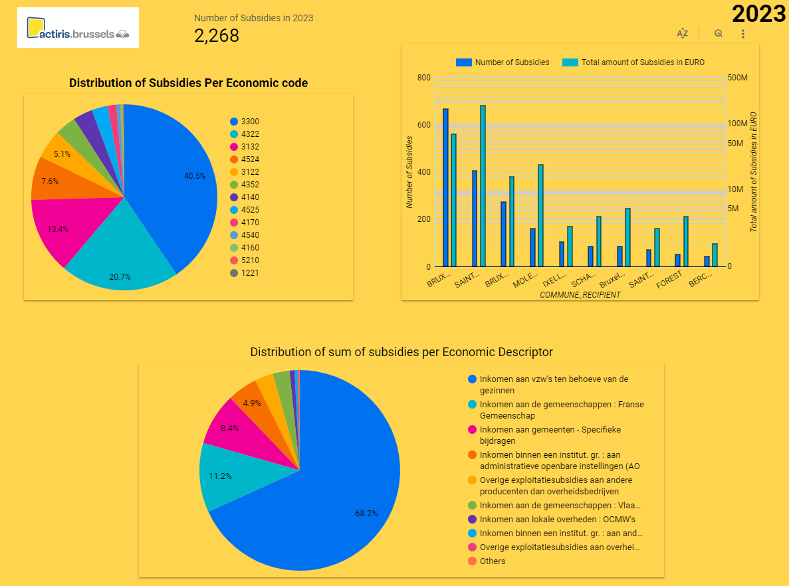
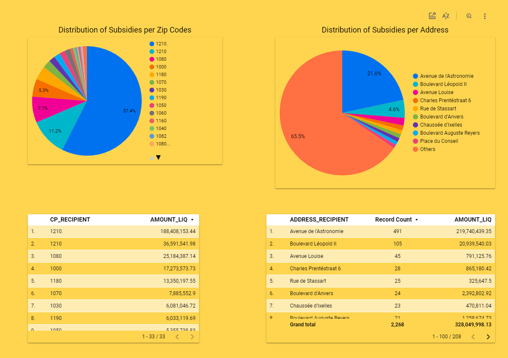
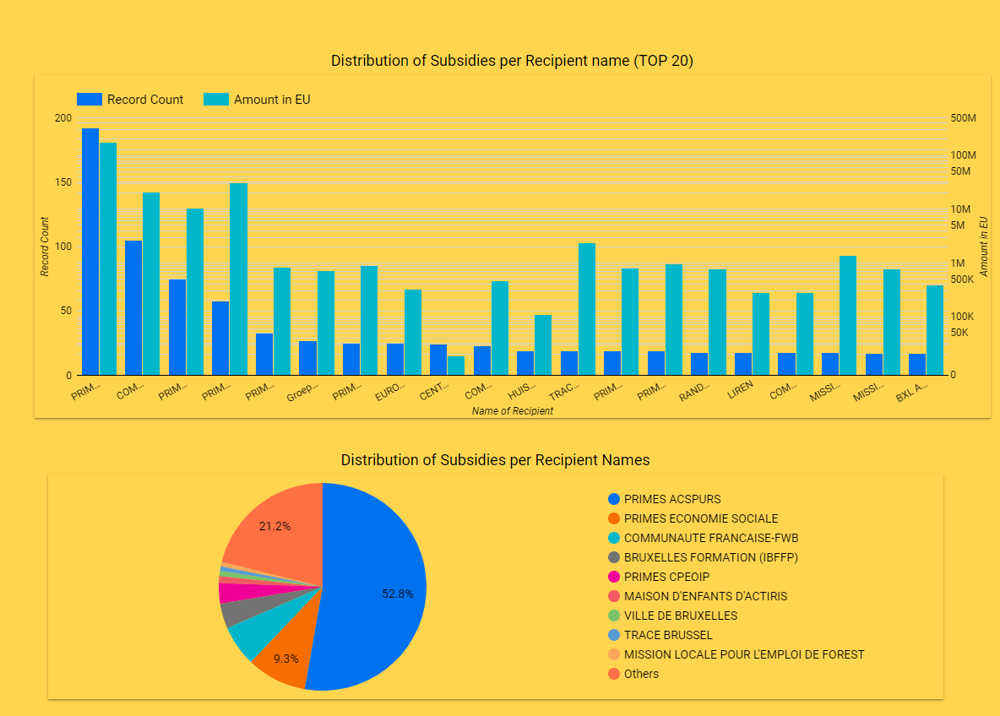
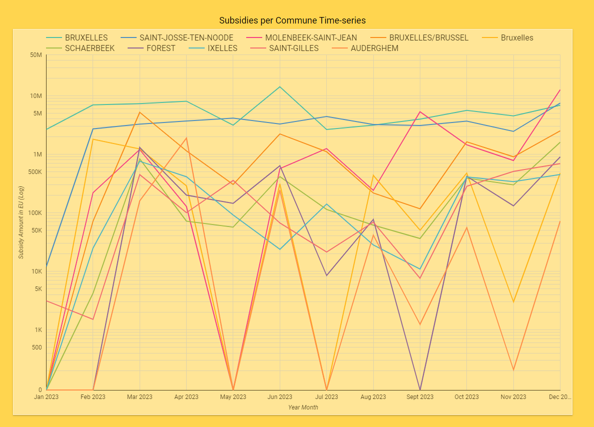

# Actiris Subsidies Data Engineering Project with Dashboard

 Data engineering project utilizing Subsidies data from Actiris (Belgium) for creating informative dashboard

Dataset acquired from datastore.brussels platform -  [Actiris Dataset](https://datastore.brussels/web/data/dataset/3a9a6fc0-375d-4bca-aa64-3e226520f557)

## Data Description & Project Aim

### Data Description

The dataset contains information about subsidies allocated and funded by Actiris in year 2023. The data is available in CSV format. 

Original dataset includes the following fields:
1. ID_BCE_ORG, 
2. NAME_ORG1_FR, 
3. NAME_ORG1_NL, 
4. NAME_ORG2_FR,
5. NAME_ORG2_NL,
6. ID_ORG3, 
7. NAME_ORG3_FR, 
8. NAME_ORG3_NL, 
9. ID_AB,
10. DESC_AB_FR, 
11. DESC_AB_NL, 
12. ACC_ID_FUNCTION, 
13. ACC_DESC_FUNCTION_FR,
14. ACC_DESC_FUNCTION_NL, 
15. ACC_ID_ECONOMIC, 
16. ACC_DESC_ECONOMIC_FR,
17. ACC_DESC_ECONOMIC_NL, 
18. ID_ENG, 
19. NAME_ENG, 
20. DATE_ENG, 
21. AMOUNT_ENG,
22. CURRENCY_ENG, 
23. ID_LIQ, 
24. NAME_LIQ, 
25. DATE_LIQ, 
26. AMOUNT_LIQ,
27. DEVCOD, 
28. ID_BCE_RECIPIENT, 
29. ID_RECIPIENT, 
30. NAME_RECIPIENT,
31. ADDRESS_RECIPIENT, 
32. CP_RECIPIENT, 
33. COMMUNE_RECIPIENT,
34. CC_RECIPIENT, 
35. BUDEXE

Since Some of the fields are repeated (in Dutch and French languages) and redundant, final dataset retains the following fields:
1. DESC_AB_NL - Description of subsidy purpose
2. ACC_ID_ECONOMIC - Economic code for subsidy type
3. ACC_DESC_ECONOMIC_NL - Descriptor for subsidy type
4. DATE_LIQ - Subsidy amount liquidation date
5. AMOUNT_LIQ - Subsidy amount in euros
6. NAME_RECIPIENT - Recipient entity name
7. ADDRESS_RECIPIENT - Recipient address 
8. CP_RECIPIENT - Recipient zip code
9. COMMUNE_RECIPIENT - Recipient Commune (Brussels)

## Project Aim

The aim of the project is to use data engineering methods with efficient data ETL practices to create a dashboard that can answer following questions:

* Which communes get highest and lowest amounts of subsidies?
* Which entities receive most number and hightest amount of subsidies?
* How does the subsidies vary monthly for various entities and communes?
* What type of subsidies are granted most often and which types account for large subsidies?

## Tech Stack 

1. [Docker](https://www.docker.com/) (Containerization of Mage)
2. [Terraform](https://developer.hashicorp.com/terraform/tutorials) (Infrastracture as Code)
3. [Google Cloud Platform](https://cloud.google.com/?hl=en) (BigQuery, Google Cloud Storage)
4. [Mage](https://github.com/mage-ai) (Workflow Orchestration)
5. [Google Looker Studio](https://lookerstudio.google.com/u/0/) (Dashboard)

## Data Workflow

## Dashboard Looker Studio

PDF version of created dashboard available in the repository. 

Online Link is available temporarily - [Dashboard Looker Studio](https://lookerstudio.google.com/s/lJe0F2h5zQM)

